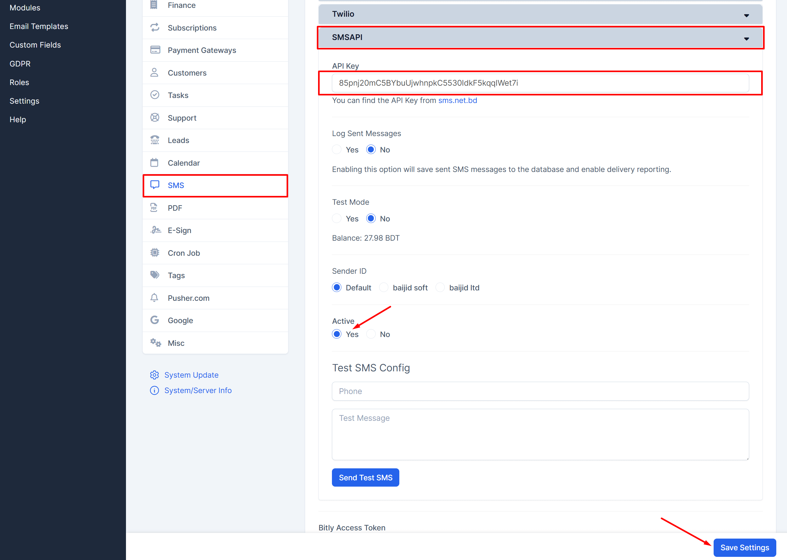

# SMS.net.bd Module for Perfex CRM

Easily integrate **[sms.net.bd](https://sms.net.bd)** with **Perfex CRM** to send SMS notifications, check balance, retrieve delivery reports, and manage SMS seamlessly.

## Features
- Send SMS directly from Perfex CRM  
- Check SMS balance  
- Retrieve delivery reports  
- Secure API-based communication  
- Easy configuration with API Key  
- Enable or disable Test Mode  
- Log sent messages for tracking  
- Invoice Overdue Notice: Trigger when invoice overdue notice is sent to customer contacts.
- Invoice Due Notice: Trigger when invoice due notice is sent to customer contacts.
- Invoice Payment Recorded: Trigger when invoice payment is recorded.
- Estimate Expiration Reminder: Trigger when expiration reminder should be send to customer contacts.
- Proposal Expiration Reminder: Trigger when expiration reminder should be send to proposal.
- New Comment on Proposal (to customer): Trigger when staff member comments on proposal, SMS will be sent to proposal number (customer/lead).
- New Comment on Proposal (to staff): Trigger when customer/lead comments on proposal, SMS will be sent to proposal creator and assigned staff member.
- New Comment on Contract (to customer): Trigger when staff member add comment to contract, SMS will be sent customer contacts.
- New Comment on Contract (to staff): Trigger when customer add comment to contract, SMS will be sent to contract creator.
- Contract Expiration Reminder: Trigger when expiration reminder should be send via Cron Job to customer contacts.
- Contract Sign Reminder: Trigger when the contract is first time sent to the customer and automatically stopped when the contract is signed.
- Staff Reminder: Trigger when staff is notified for a specific custom reminder.

## Prerequisites
- Perfex CRM Version greater than 3.2.1
- SMS.net.bd module version 1.0.1
- An account on **[sms.net.bd](https://sms.net.bd/signup)**

## Installation Instructions

1. **Download the Latest Release**
   
   Get the latest `smsnetbd.zip` file from the official **sms.net.bd** module repository.

2. **Upload the Module**
   
   - Log in to your Perfex CRM admin panel.
   - Navigate to `Setup` > `Modules`.
   - Click on the `Upload Module` button.
   - Upload the `smsnetbd.zip` file you downloaded in step 1.

3. **Activate the Module**
   
   - After uploading, find the module in the list of available modules.
   - Click on the `Activate` button next to the module.

    

   

4. **Configure the Module**
   
   - Once activated, navigate to `Setup` > `Settings` > `SMS` > `SMSAPI`.
   - Enter your API Key and configure the settings as needed.

   

5. **Start Using the Module**
   
   - You can now start sending SMS notifications from Perfex CRM.

## Additional Configuration

### 1. API Key Setup
   
   - Log in to your **sms.net.bd** account.
   - Navigate to `API Menu` > `+ Generate API KAY`.
   - Copy the generated token and paste it into the **API Key** field in the module settings.

### 2. Sender ID Configuration (Optional)
   
   - Log in to your **sms.net.bd** account.
   - Navigate to `Messaging` > `Create Sender ID`.
   - Add or select your approved Sender ID.
   - Select at a time one Sender ID in the module settings.

### 3. Test Mode Selection
   
   - The module allows testing SMS sending before going live.
   - Enable or disable **Test Mode** by selecting `Yes` or `No`.
   - In test mode, SMS will be sent but logged for testing purposes.

   

### 4. Log Sent Messages
   
   - This module includes an option to log all sent messages.
   - Enable or disable the **Log Sent Messages** option by selecting `Yes` or `No` in the module settings.
   - When enabled, sent messages will be recorded for tracking purposes.

   

   

## Troubleshooting

If you encounter any issues during installation or usage, please check the following:

- Ensure that you have the correct permissions to upload and activate modules in Perfex CRM.
- Verify that your **SMS